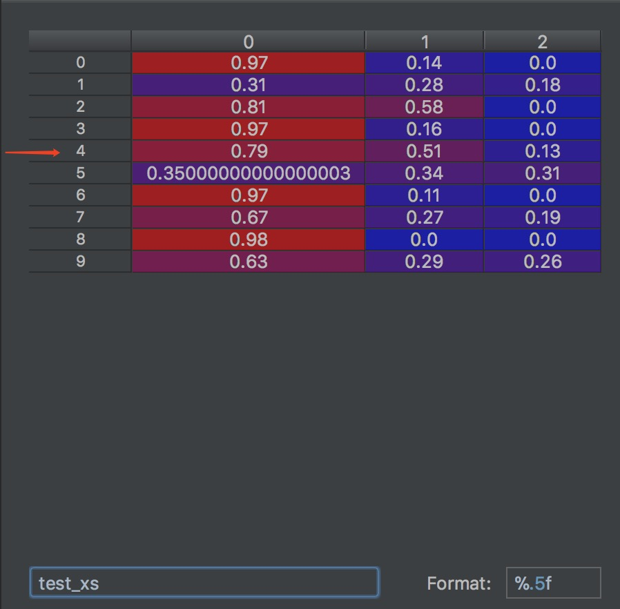
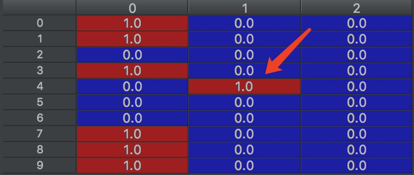
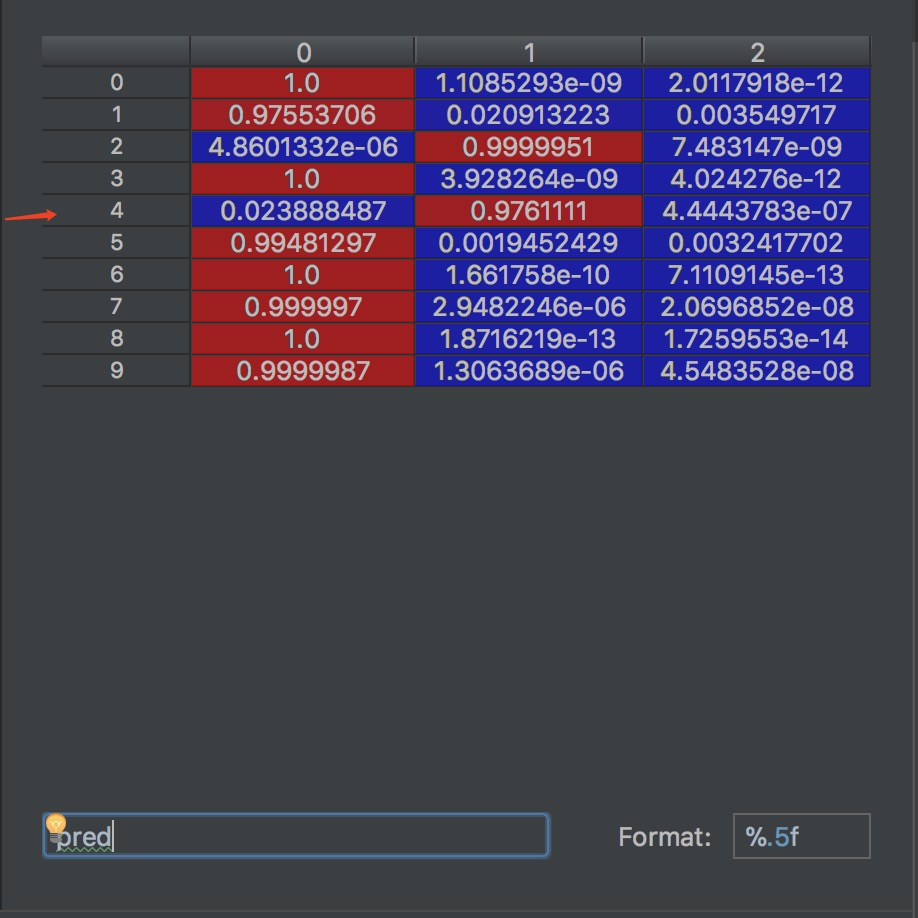

## 背景

在刘嘉老师非常支持使用别人已经做过的东西的前提下，并且我们认为我们训练出来的不管是图像识别提示还是文本分词肯定比不上网上已有的，所以我们全部使用现成api，但是在研究了现成api后，我们发现图像识别api直接用来套我们的图像识别提示有一定的不适应性，比如当我上传一张画，画中画着鸟，图像识别api以极高置信度识别出是画，但是作为一个标注任务，我们当然知道，一般来说发布者需要的答案是鸟，并且，我们在实践中发现，这样一个文本标注提示其实也是非常需要的，因为图像标注者其实需要的知识也非常多，比如，简单的标注一朵菊花，而菊花的形态有非常多，这里就很需要标注提示。所以，基于此，我们决定针对图像识别api进行迁移学习，基于发布者需要的提示与图像识别api建立一个优化数据模型，使api的结果更适应标注系统。

## 数据来源

组员手动标注了110组图片数据

## 算法解释

1、数据预处理：我们规定了一张图片基于提示的最大数量$n$，并对已有的api提供的提示的进行过滤，提取出置信度最高的$n$个，并基于最终用户给出的标注答案对提示使用情况进行归一化处理，得到输入数据
$$y_{ij}=\begin{cases}0&& {X_{ij} \ in \ Y_i}\\1&& {X_{ij} \ not \ in \ Y_i}\end{cases}$$

2、预测评估：我们认为我们系统的预测正确性可以被以下公式量化描述
$$\phi=\sum_{i=1}^{n}{\hat y_{i}*y_{i}}$$
由于我们训练是使用批量梯度下降算法，所以，我们对以上公式进行一定的改进
$$\phi=\frac{\sum_{j=1}^{m}\sum_{i=1}^{n}{\hat y_{ij}*y_{ij}}}{m}$$
以上$X_{ij}$为输入提示标签, $Y_{i}$为输入标注答案, $m$为批度大小，$\hat y_{i}$为预测值，$y_{i}$为标签值,$y_{i·}$为单组标签的总预测值$\sum_{i=1}^{n}\hat y_{ij}$

3、算法描述：由于数据量不足，我们仅使用单隐层的神经网络对输入的置信度进行估计。
- 首先为了提高系统的鲁棒性，我们在对数据进行计算前加入高斯白噪声 $X=X+e$
- 接下来使用 $O=g(W_{hidden}X+B_{hidden})$ 计算隐层输出,这里使用隐层神经元128个，激活函数$g$使用relu函数，并为防止过拟合，训练时在此使用dropout=0.7
- 然后直接连接输出层 $\hat y=\theta(W_{output}O+B_{output})$得到输出值，$\theta$函数对结果进行归一化，使用softmax进行归一化的处理，并再计算一次$y_i=\frac{y_i}{\hat y}$
- 然后根据已有的数据，计算$\hat y$的拒绝域.
首先根据被接受的提示的$\hat y$进行降序排列,即对于一个结果数组P，如果$y_{ij}=1$则将$\hat y$加入P中，然后对P进行降序排列，取第$\alpha*N$项，其中$\alpha$为显著值，$N$为P数组长度.

4、学习过程：使用交叉熵来作为神经网络的代价函数，批量梯度下降来学习参数

## 调用描述

1、在每次工人进行图片整体标注时根据原始的api提供的confidence进行预测

2、每次工人提价图片整体标注结果后将所得数据传入模型进行异步训练

## 训练结果

对于同等数量的10副图，我们进行测试。

训练前光使用api给出的confidence进行计算的结果：

训练之后的结果：

正确率由原来的0.462提高到了0.899
研究数据发现index为9的数据中，api给出的confidence序列为[0.34,0.14,0.14]而正确的标注答案为0.14中的一个，这使得现阶段的算法无法分辨出正确的结果，考虑后阶段的改进.

以下再举一个训练后的例子

注意看这里第四条数据，它的答案标签对应的原始confidence的确不是最高的，但是进过模型估计之后，它答案标签的估计值的确成为了最大的